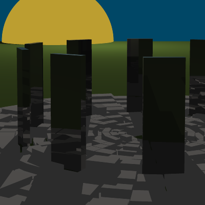

# Ray trace: Monolith city

Terrorised by those that live in the shadows. Monoliths made from black metal repel them from one of the last surviving human cities. Yet, living in the eclipsing shadows of those structures seems to be taking its toll.

This is an application that raytraces a scene as described by a `.json` file.

## Screenshots

## How to run

*Warning!* Ray tracing the given scene may take 20 minutes on a single-threaded machine.

1. Create a `build/` directory in the project root (`mkdir build`)
2. `cd build`
3. `cmake ..`
4. `make`
5. `./ray ../Scenes/scene.json`

This will create render the scene as a PNG file in `../Scenes/scene.png`.

